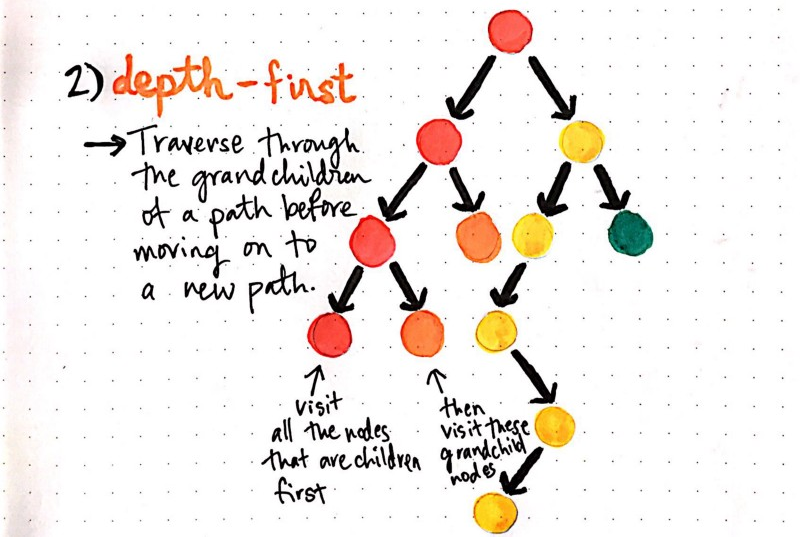

- title : Saving New York with Bruce Willis, Bloxorz and F#
- description : Playing with F#
- author : Milosz Krajewski
- theme : beige
- transition : default

***

# Saving New York with Bruce Willis, Bloxorz and F#

***

## Live coding

---


***

## Breadth-First Search

---


***

## Depth-First Search

---



***

PowerShell
```powershell
gci -r -dir | % { $_.FullName } | oh -p
```

Bash
```bash
find -type d | less
```

***

## BFS vs DFS

`Queue` vs `Stack`

---


***

## Bloxorz

---

http://abcarcade.com/fullscreen.php?id=1573

---


---


---


***

## But where the fuck is Bruce Willis?

---

https://www.youtube.com/watch?v=6cAbgAaEOVE

***


